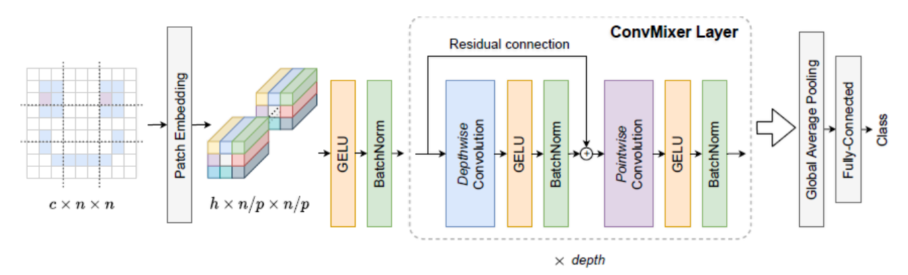

# ConvMixer: Patches Are All You Need? 🚀

A PyTorch implementation and comprehensive experimental study of the ConvMixer architecture from the paper ["Patches Are All You Need?"](https://arxiv.org/abs/2201.09792). This project explores various architectural modifications and hyperparameter optimizations to improve performance on the CIFAR-10 dataset.

## 📋 Table of Contents

- [Overview](#overview)
- [Architecture](#architecture)
- [Implementation](#implementation)
- [Experiments](#experiments)
- [Results](#results)
- [Installation](#installation)
- [Usage](#usage)
- [Project Structure](#project-structure)
- [Contributing](#contributing)

## 🎯 Overview

The ConvMixer is a simple yet effective convolutional neural network that achieves competitive performance on image classification tasks. The main innovation is replacing traditional spatial mixing operations with:

- **Depthwise convolutions** for spatial mixing
- **Pointwise convolutions** for channel mixing
- **Patch embeddings** to preserve locality
- **Residual connections** for better gradient flow

This approach maintains computational efficiency while capturing long-range dependencies effectively.

## 🏗️ Architecture


*ConvMixer architecture overview showing patch embedding, ConvMixer blocks, and classification head*

The ConvMixer architecture consists of:

1. **Patch Embedding**: Divides input into non-overlapping patches
2. **ConvMixer Blocks**: Depth-wise and point-wise convolutions with residual connections
3. **Global Average Pooling**: Reduces spatial dimensions
4. **Classification Head**: Linear layer for final predictions

### Core Implementation

```python
# ConvMixer model architecture
def ConvMixer(dim, depth, kernel_size=5, patch_size=2, n_classes=10):
    return nn.Sequential(
        nn.Conv2d(3, dim, kernel_size=patch_size, stride=patch_size),
        nn.GELU(),
        nn.BatchNorm2d(dim),
        *[nn.Sequential(
                Residual(nn.Sequential(
                    nn.Conv2d(dim, dim, kernel_size, groups=dim, padding="same"),
                    nn.GELU(),
                    nn.BatchNorm2d(dim)
                )),
                nn.Conv2d(dim, dim, kernel_size=1),
                nn.GELU(),
                nn.BatchNorm2d(dim)
        ) for i in range(depth)],
        nn.AdaptiveAvgPool2d((1,1)),
        nn.Flatten(),
        nn.Linear(dim, n_classes)
    )
```

## 🔬 Implementation Details

### Baseline Model Configuration

Based on extensive experiments in the original paper, our baseline model uses:

- **Hidden Dimension (h)**: 256 - optimal balance between performance and efficiency
- **Depth (d)**: 8 - good trade-off between accuracy and computational cost
- **Patch Size (p)**: 2 - maintains good performance while reducing spatial dimensions
- **Kernel Size (k)**: 9 - larger kernels for better long-range dependencies
- **Weight Decay**: 1e-2 - prevents overfitting effectively

### Training Features

- **Mixed Precision Training**: Using PyTorch AMP for efficiency
- **Cosine Annealing**: Learning rate scheduling for better convergence
- **Data Augmentation**: RandAugment, random cropping, horizontal flipping
- **AdamW Optimizer**: With gradient clipping for stability

## 🧪 Experiments

This project extends the original work with four key experimental variations:

### 1. Hidden Dimension Scaling
- **Baseline**: 256 → **Enhanced**: 512
- **Result**: 92.24% → 93.05% test accuracy (+0.81%)
- **Trade-off**: 32.59s → 46.41s per epoch

### 2. Classifier Architecture Variations

#### RepresentationHead Classifier (ConvMixerRH)
- Additional normalization and linear layers
- **Result**: 92.32% accuracy with better regularization
- **Benefit**: Reduced overfitting (smaller train-test gap)

#### Linear Classifier (ConvMixerLC)
- Batch normalization + dropout regularization
- **Result**: 92.20% accuracy with fastest training (32.18s/epoch)
- **Benefit**: Best computational efficiency

### 3. Hyperparameter Grid Search
Systematic tuning of:
- **Learning Rate**: [0.001, 0.01, 0.1]
- **Weight Decay**: [0.0001, 0.001, 0.01]
- **Batch Size**: [64, 128, 256]

**Optimal Configuration**:
- Learning Rate: 0.01
- Weight Decay: 0.0001
- Batch Size: 256

**Result**: 92.74% accuracy with 24.19s/epoch (25% speed improvement)

### 4. Bottleneck Architecture (ConvMixerBN)
- 1×1 conv → depthwise conv → 1×1 conv structure
- **Result**: 91.83% accuracy (performance degradation)
- **Finding**: Bottleneck too restrictive for CIFAR-10 complexity

## 📊 Results Summary

| Model | Test Accuracy | Train Accuracy | Epoch Time | Key Insight |
|-------|---------------|----------------|------------|-------------|
| Baseline | 92.24% | 94.20% | 32.59s | Strong foundation |
| Hidden Dim 512 | **93.05%** | 96.54% | 46.41s | Best accuracy |
| ConvMixerRH | 92.32% | 93.64% | 33.29s | Better generalization |
| ConvMixerLC | 92.20% | 93.64% | **32.18s** | Most efficient |
| Grid Search Tuned | 92.74% | 94.02% | **24.19s** | Best balance |
| ConvMixerBN | 91.83% | 92.17% | 37.40s | Architectural limitation |

## 🚀 Installation

```bash
# Clone the repository
git clone https://github.com/yourusername/convmixer-experiments.git
cd convmixer-experiments

# Create virtual environment
python -m venv convmixer_env
source convmixer_env/bin/activate  # On Windows: convmixer_env\Scripts\activate

# Install dependencies
pip install torch torchvision torchaudio
pip install timm
pip install matplotlib seaborn
```

## 💻 Usage

### Basic Training

```bash
# Train baseline model
python train.py --model convmixer --epochs 25 --batch_size 512

# Train with increased hidden dimension
python train.py --model convmixer --hidden_dim 512 --epochs 25

# Train with RepresentationHead classifier
python train.py --model convmixer_rh --epochs 25

# Run hyperparameter grid search
python grid_search.py --search_space lr,wd,batch_size
```

### Custom Configuration

```python
from models import ConvMixer

# Create custom model
model = ConvMixer(
    dim=256,           # Hidden dimension
    depth=8,           # Number of ConvMixer blocks
    kernel_size=9,     # Depthwise conv kernel size
    patch_size=2,      # Patch embedding size
    n_classes=10       # Output classes
)
```

## 📁 Project Structure

```
convmixer-experiments/
├── models/
│   ├── convmixer.py          # Core ConvMixer implementation
│   ├── variants.py           # Architecture variants
│   └── classifiers.py        # Custom classifier heads
├── data/
│   └── cifar10_loader.py     # Data loading and preprocessing
├── training/
│   ├── train.py              # Training loop
│   ├── evaluate.py           # Evaluation utilities
│   └── grid_search.py        # Hyperparameter tuning
├── experiments/
│   ├── hidden_dim_exp.py     # Hidden dimension experiments
│   ├── classifier_exp.py     # Classifier variant experiments
│   └── bottleneck_exp.py     # Bottleneck architecture experiments
├── utils/
│   ├── metrics.py            # Performance metrics
│   └── visualization.py      # Result plotting
├── results/                  # Experimental results
├── requirements.txt          # Dependencies
└── README.md                # This file
```

## 🔍 Key Insights

1. **Model Capacity Matters**: Increasing hidden dimension provides significant accuracy gains
2. **Efficiency vs Performance**: Grid search optimization achieves best balance of speed and accuracy
3. **Regularization Effects**: Custom classifiers reduce overfitting but may sacrifice peak performance
4. **Architecture Constraints**: Bottleneck design too restrictive for CIFAR-10's complexity
5. **Hyperparameter Impact**: Systematic tuning yields consistent improvements

## 🎯 Future Work

- **Advanced Regularization**: Implementing dropout, label smoothing, and mixup
- **Multi-Dataset Evaluation**: Testing on ImageNet, CIFAR-100, and custom datasets
- **Architecture Search**: Automated neural architecture search for optimal configurations
- **Deployment Optimization**: Model quantization and pruning for edge devices

## 🤝 Contributing

Contributions are welcome! Please feel free to submit a Pull Request. For major changes, please open an issue first to discuss what you would like to change.

## 📄 License

This project is licensed under the MIT License - see the [LICENSE](LICENSE) file for details.

## 🙏 Acknowledgments

- Original ConvMixer paper: ["Patches Are All You Need?"](https://arxiv.org/abs/2201.09792)
- PyTorch team for the excellent deep learning framework
- CIFAR-10 dataset creators for the benchmark dataset

## 📞 Contact

For questions or collaborations, please reach out via:
Guy Damari - damariguy7@gmail.com
Noa Cohen - noa.j.cohen@gmail.com

---

**Note**: This implementation is for research and educational purposes. For production use, consider additional optimizations and thorough testing.
